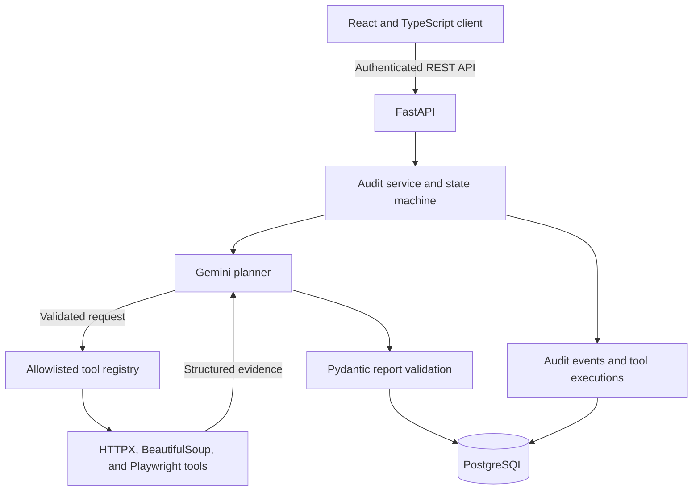

# Site Scan AI

An evidence-first website auditing platform that combines deterministic Python
tools with Google Gemini to produce clear, traceable audit reports.

[View the live application](https://sitescanai.razsoft.in/)

## Try the demo

Use the shared portfolio account to explore the complete audit workflow:

| Field | Value |
| --- | --- |
| Email | `test@example.com` |
| Password | `Test@1234` |

This is a public account. Do not submit private, confidential, or internal URLs.

## The problem it solves

Auditing a website often requires several disconnected tools for metadata,
security headers, broken links, and browser errors. The results are usually
scattered and difficult to turn into a practical list of improvements.

An LLM by itself is not a reliable scanner because it can describe issues it
has not actually observed. Site Scan AI uses a hybrid approach:

- Python tools collect facts directly from HTTP responses and Chromium.
- Gemini selects the relevant tools and explains their results.
- Every finding must reference evidence returned by an executed tool.
- Pydantic validates the final report before it is stored.

The core principle is: **AI plans and explains; deterministic code collects the
evidence.**

## Main features

- User registration, login, and JWT-based authentication.
- Custom website audits based on a URL and natural-language instruction.
- Gemini-powered tool selection through controlled function calling.
- Metadata, security-header, broken-link, and browser-runtime inspection.
- Evidence-backed findings with severity, category, and recommended fixes.
- Release-readiness states such as ready, needs attention, blocked, and unknown.
- Full audit history with workflow events and individual tool executions.
- Responsive React dashboard with raw evidence and execution details.
- Full-page browser screenshots for runtime audits.

## Deterministic audit tools

| Tool | What it checks |
| --- | --- |
| `inspect_metadata` | HTTP status, title, description, canonical URL, robots, viewport, Open Graph fields, headings, image `alt` coverage, language, and page size |
| `inspect_security_headers` | CSP, HSTS, content-type protection, referrer policy, permissions policy, and clickjacking protection |
| `check_broken_links` | Extracted and normalized links, redirects, working links, broken links, timeouts, and final response statuses |
| `inspect_browser` | Rendered title, page status, final URL, JavaScript errors, failed requests, load duration, response size, and screenshot |

Gemini never decides whether a header, metadata field, or broken link exists.
Those results come from the deterministic tools.

## Architecture

### Agent workflow

1. The user submits a public URL and an audit instruction.
2. The backend validates the target before allowing a network request.
3. Gemini selects from four explicitly declared tools.
4. The backend validates the tool name, arguments, target URL, and workflow
   limits.
5. The selected Python tools collect structured evidence.
6. Gemini converts that evidence into an `AuditReport`.
7. The backend verifies the report and saves it with its complete execution
   history.

Only functions in a hard-coded registry can run. The project does not use
`eval()`, dynamic imports, or unrestricted function names supplied by the
model.

## Evidence and security safeguards

The reporting workflow rejects unsupported claims and prevents Gemini from:

- Referencing a tool that was not executed.
- Changing the approved audit target.
- Calling the same tool repeatedly.
- Inventing headers, status codes, URLs, errors, screenshots, or scores.
- Treating text from the inspected website as trusted instructions.

Because the backend visits user-supplied URLs, it also implements SSRF
protection. It blocks non-HTTP protocols, local and internal hostnames,
non-public IPv4 and IPv6 addresses, unsafe redirects, private browser
subresources, and browser WebSocket requests.

Request timeouts, response-size limits, redirect limits, link limits, bounded
concurrency, and one browser scan at a time help control resource usage.

## Application structure

### Frontend

- React 19, TypeScript, Vite, and Tailwind CSS.
- Zustand for authentication and audit state.
- Zod for form validation and runtime API-response validation.
- Clean dashboard for creating audits and reviewing findings, recommendations,
  tool results, durations, and evidence.

### Backend

- FastAPI routes for authentication and user-owned audits.
- Service layer for business logic and audit status transitions.
- Pydantic schemas for strict request, tool-result, and report contracts.
- SQLAlchemy models backed by PostgreSQL and JSONB.
- Google Gemini orchestration with an allowlisted tool registry.
- HTTPX and BeautifulSoup for deterministic HTTP inspection.
- Playwright and Chromium for browser-runtime analysis.
- Structured application logs with detailed internal exceptions.

### Data model

| Model | Responsibility |
| --- | --- |
| `User` | Account identity, password hash, active state, and timestamps |
| `Audit` | Target, instruction, workflow status, report, release status, and timing |
| `AuditEvent` | Ordered history of audit creation, transitions, tool activity, completion, and failure |
| `ToolExecution` | Tool arguments, evidence, errors, result status, duration, sequence, and screenshot reference |

## Technology stack

**Frontend:** React 19, TypeScript, Vite, Tailwind CSS, Zustand, and Zod.

**Backend:** Python 3.11, FastAPI, Pydantic, SQLAlchemy, PostgreSQL, Google
Gemini, HTTPX, BeautifulSoup, Playwright, JWT, and Argon2 password hashing.

## Project status

Site Scan AI is a portfolio project under active development. The current
version demonstrates the complete evidence-first auditing workflow, and more
features, deeper audit capabilities, and usability improvements are coming.
